# Manual de Usuario: Autoservicio, Asistencia, Permisos, Vacaciones y Reportes

## Proposito del manual

Este manual explica como usar las opciones personales del sistema: hoja de vida, control de asistencia, marcaciones, solicitudes de permisos, vacaciones, aprobaciones, justificaciones y reportes relacionados.

Version con imagenes incrustadas directamente:

`docs/manual-autoservicio-asistencia-permisos-vacaciones.html`

## 1. Ingreso al sistema

El usuario inicia sesion con sus credenciales institucionales. Luego puede acceder a las opciones disponibles desde el menu lateral.

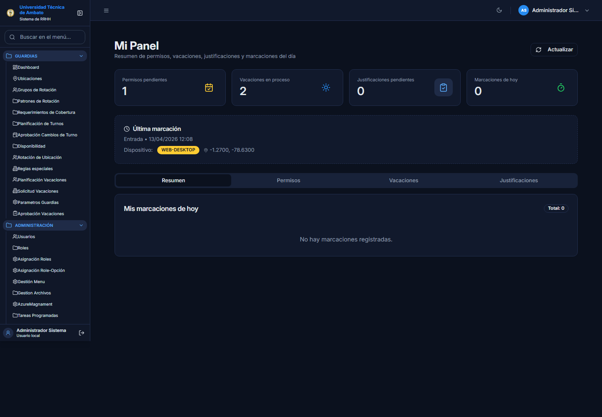

## 2. Hoja de vida / Perfil personal

La pantalla de perfil o hoja de vida muestra la informacion personal del usuario. Desde aqui se consulta la informacion registrada en el sistema, como datos personales, informacion laboral y secciones relacionadas al expediente del empleado.

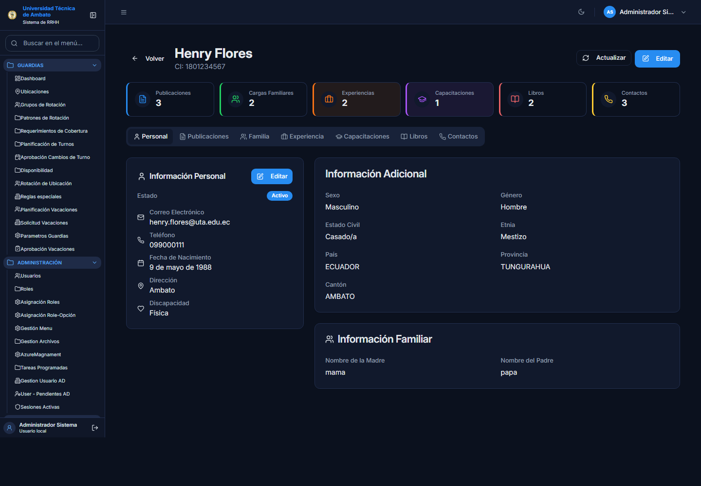

Use esta pantalla para verificar que sus datos principales esten correctos. Si encuentra informacion desactualizada, debe solicitar la correccion al area responsable.

## 3. Mi control de asistencia y picadas

La pantalla **Mi Control de Asistencia** permite revisar las marcaciones o picadas del dia, el estado de asistencia y la informacion relacionada con el horario asignado.

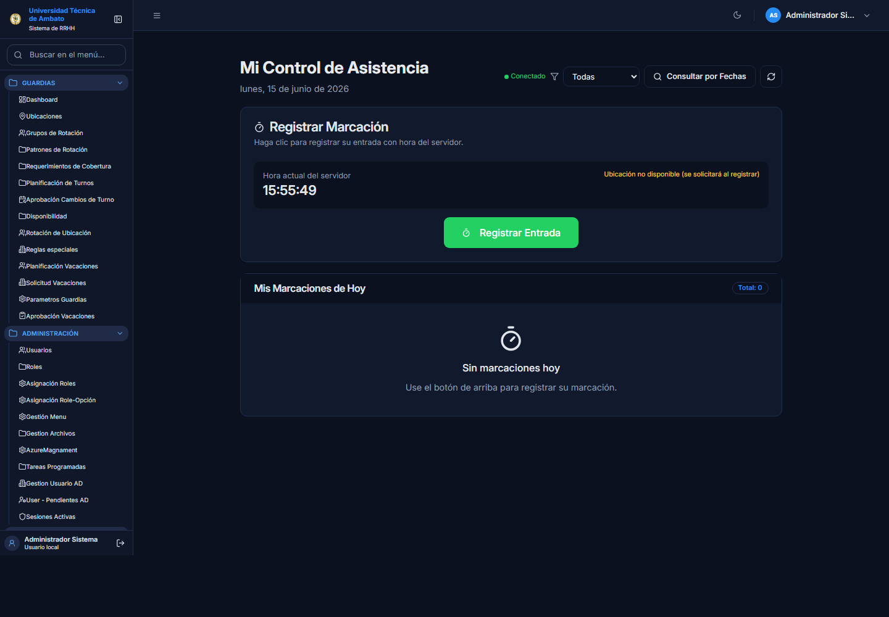

En esta pantalla el usuario puede revisar si sus marcaciones fueron registradas correctamente. Tambien puede actualizar la informacion para consultar los datos mas recientes.

### Consulta de marcaciones por rango

El dialogo **Consultar Marcaciones por Rango** permite buscar marcaciones en un periodo especifico. Se debe ingresar la fecha de inicio y la fecha de fin.

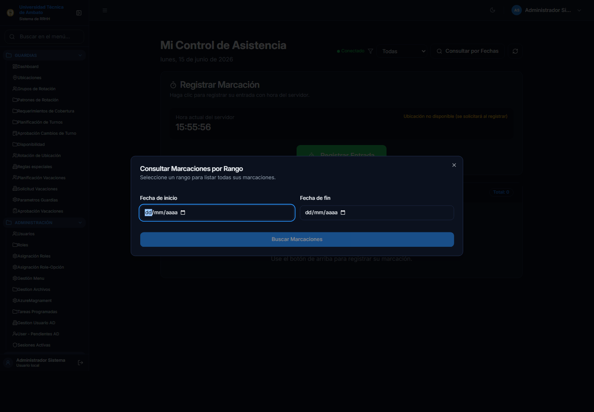

Use esta consulta cuando necesite revisar dias anteriores, validar asistencia semanal o comprobar marcaciones antes de solicitar una justificacion.

## 4. Solicitud de permisos y vacaciones

La pantalla **Permisos y Vacaciones** centraliza las solicitudes personales. Permite consultar el saldo disponible, filtrar solicitudes existentes y crear nuevos permisos.

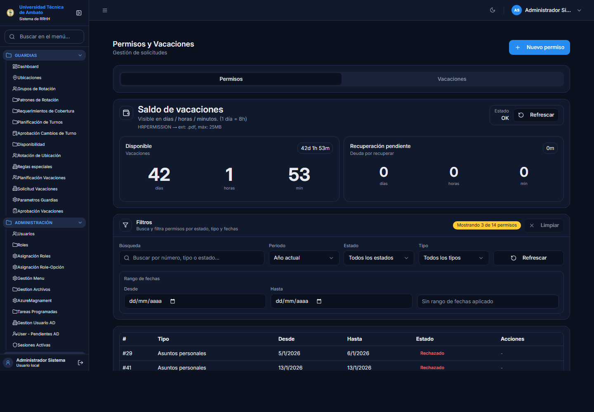

La pantalla muestra el saldo de vacaciones en dias, horas y minutos. Tambien permite filtrar por periodo, estado, tipo y rango de fechas.

### Formulario: Nuevo permiso

El formulario **Nuevo permiso** se utiliza para registrar una solicitud de permiso. El usuario debe seleccionar el tipo de permiso, el modo, la fecha y escribir la justificacion.

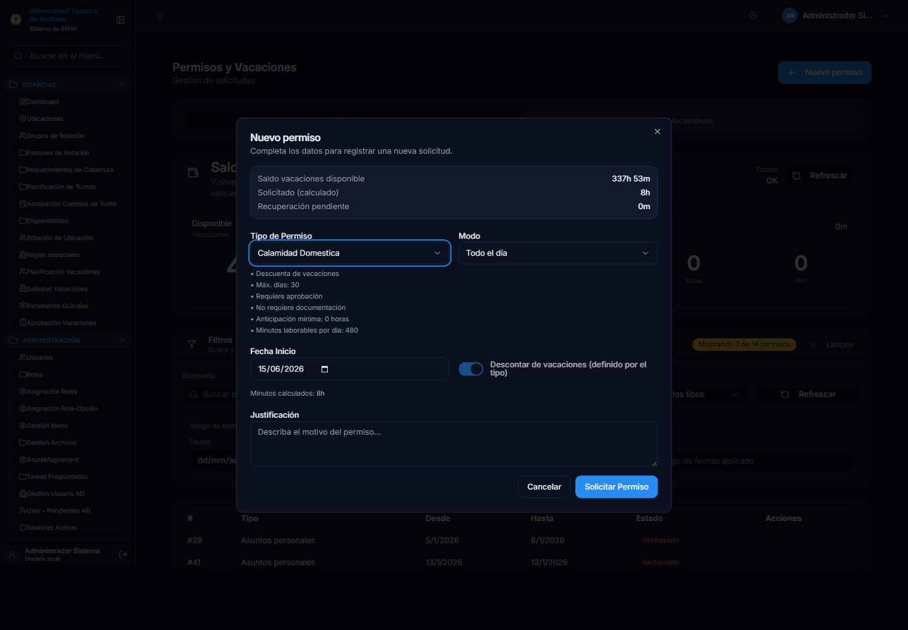

El sistema muestra informacion del tipo de permiso seleccionado, como si descuenta vacaciones, si requiere aprobacion, si requiere documentacion y los limites permitidos.

## 5. Gestion de vacaciones

La pantalla **Gestion de Vacaciones** permite consultar vacaciones registradas y su estado.

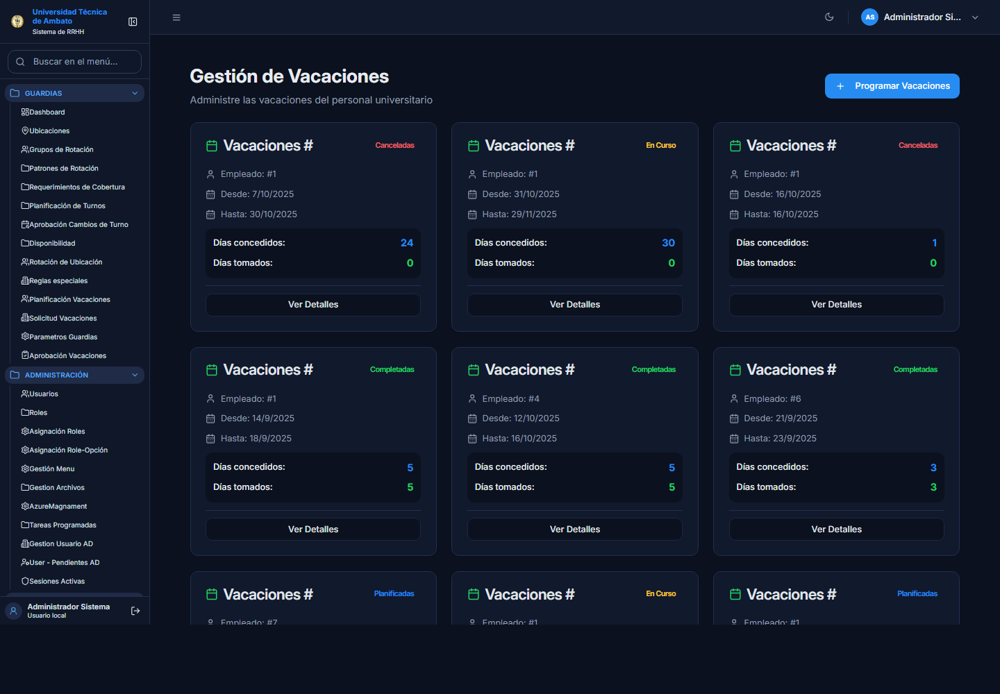

Use esta pantalla para revisar periodos de vacaciones y verificar si existen registros aprobados, pendientes o rechazados.

## 6. Aprobaciones de permisos, vacaciones y justificaciones

La pantalla **Aprobaciones** permite revisar solicitudes pendientes o historicas de permisos, vacaciones y justificaciones.

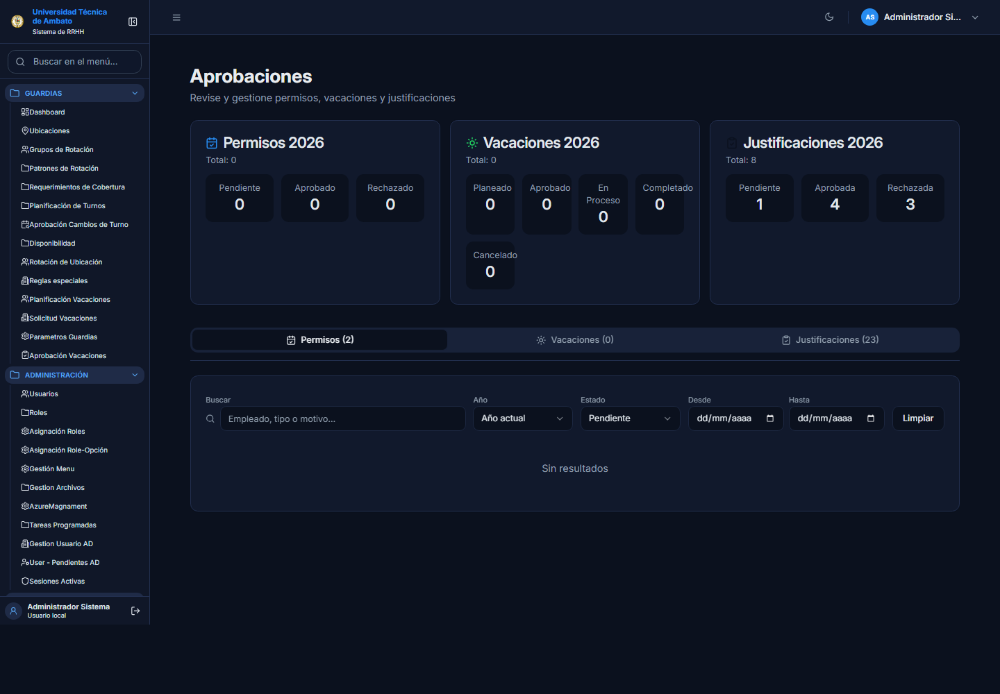

La pantalla cuenta con pestanas para separar los tipos de solicitud:

- Permisos.
- Vacaciones.
- Justificaciones.

El usuario responsable puede filtrar por empleado, estado, ano y fechas. Si existen solicitudes pendientes, desde la columna de acciones se puede aprobar o rechazar segun corresponda.

## 7. Aprobaciones de permisos medicos

La pantalla de aprobaciones medicas permite revisar solicitudes de permisos medicos y sus documentos adjuntos.

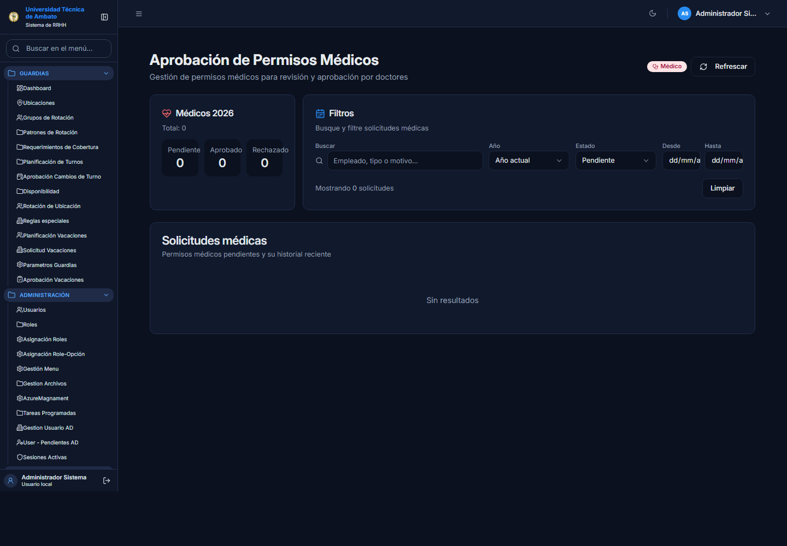

Use esta pantalla cuando se requiera validar soporte documental o revisar permisos medicos separados del flujo general.

## 8. Justificaciones de marcaciones

La pantalla **Justificacion de Marcaciones** permite consultar y solicitar justificaciones cuando existe una novedad en asistencia, como falta de marcacion, atraso o ausencia justificada.

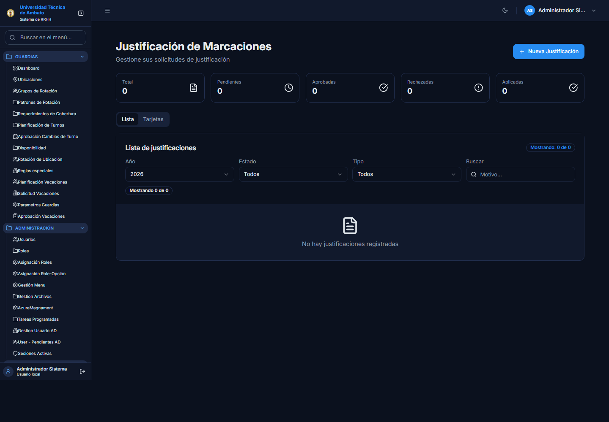

Se puede revisar la lista de justificaciones, filtrar por estado o tipo y consultar el detalle de cada registro.

### Formulario: Solicitar justificacion

El formulario **Solicitar Justificacion** permite registrar una nueva solicitud. El usuario debe completar los datos solicitados y explicar claramente el motivo.

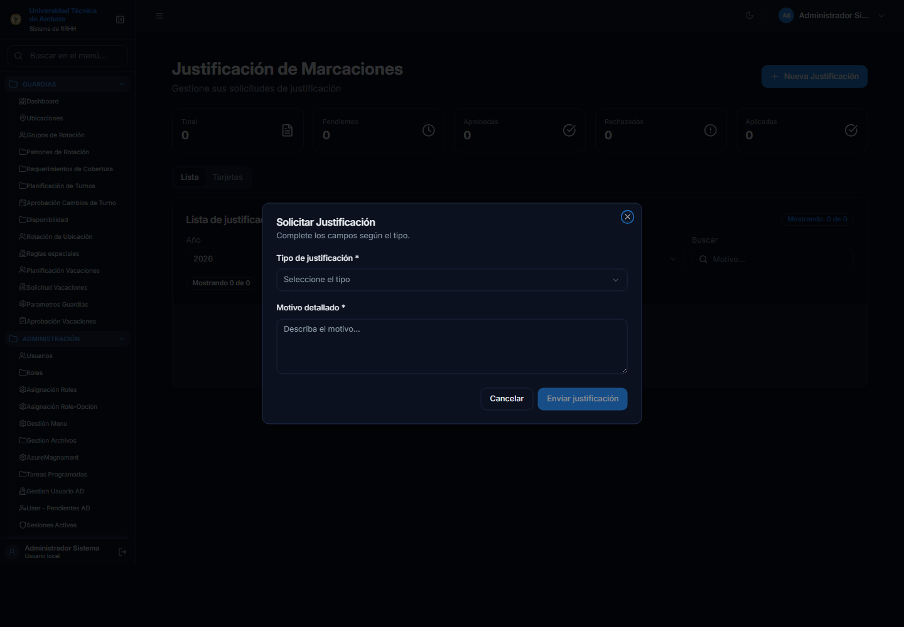

Antes de crear una justificacion, revise primero sus marcaciones para confirmar la fecha y la novedad que desea justificar.

## 9. Centro de reportes

El **Centro de Reportes** agrupa los reportes disponibles para consulta, vista previa y descarga.

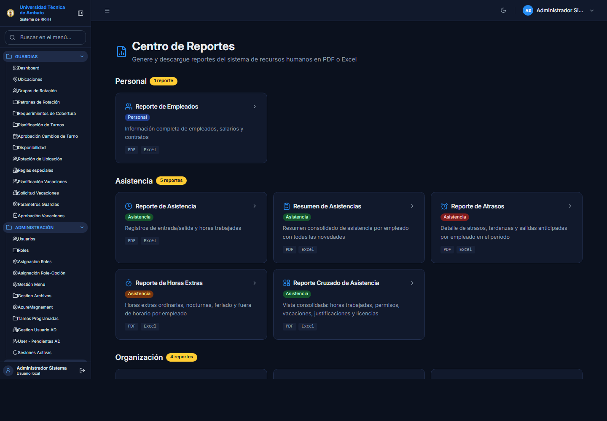

Cada reporte cuenta con filtros y botones para generar vista previa, PDF o Excel segun la configuracion disponible.

## 10. Reporte de asistencia

Este reporte permite consultar registros de asistencia por empleado y rango de fechas.

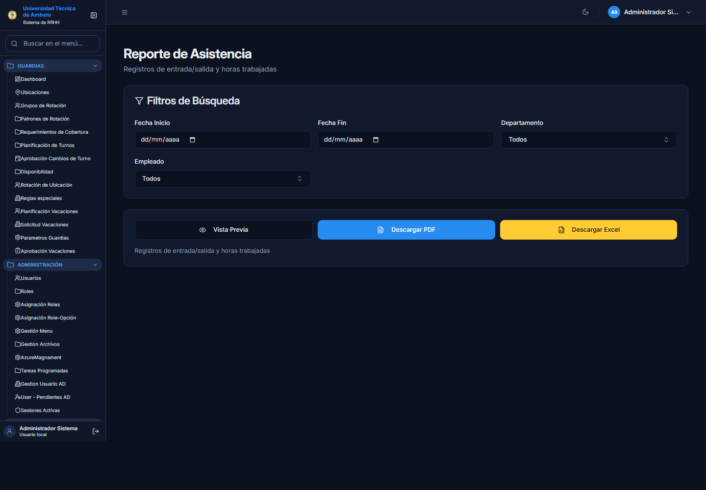

Use este reporte para revisar marcaciones, estados y novedades de asistencia.

## 11. Reporte resumen de asistencia

Este reporte resume informacion de asistencia en un periodo determinado.

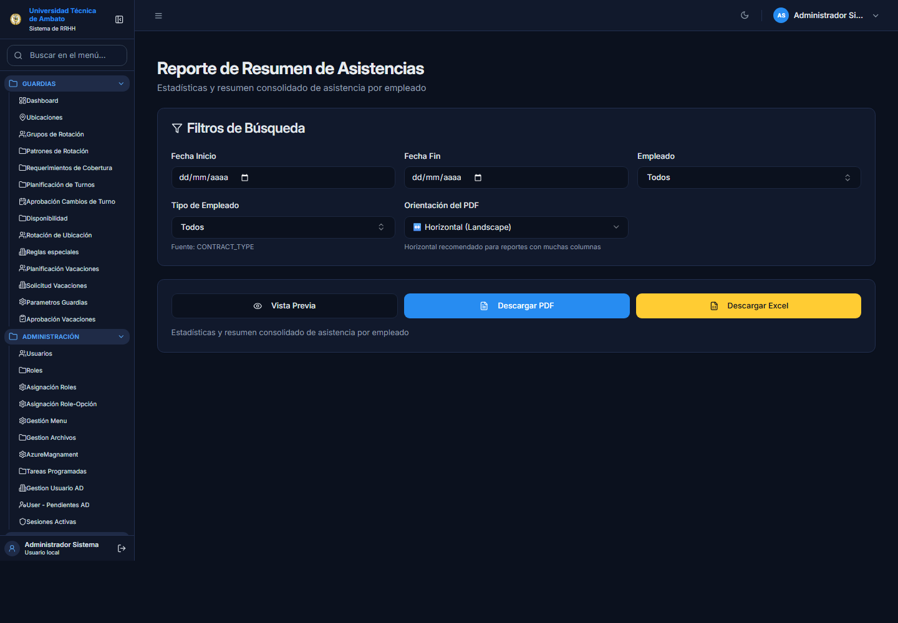

Es util para revisar acumulados y resultados consolidados.

## 12. Reporte de atrasos

El reporte de atrasos permite identificar empleados con llegadas tardias dentro de un periodo.

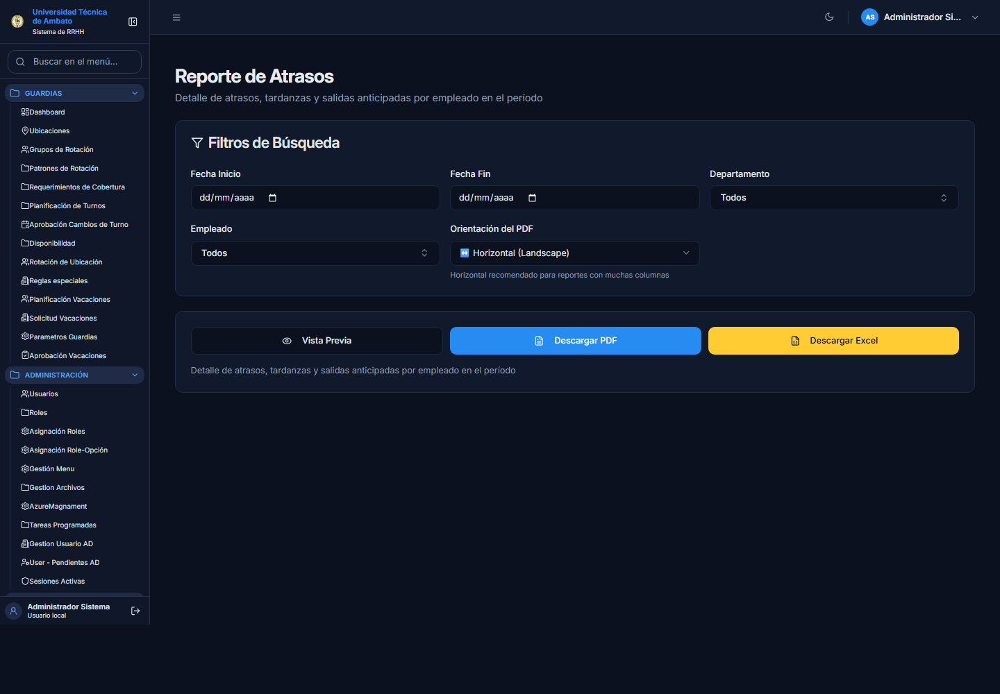

Use filtros de fecha y empleado para limitar la busqueda.

## 13. Reporte de horas extra

Este reporte permite revisar horas extra registradas o calculadas.

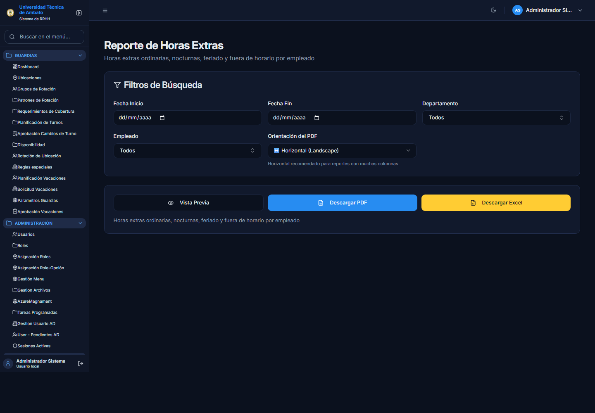

Se recomienda usarlo para control previo a procesos administrativos o de nomina.

## 14. Reporte cruce de asistencia

El reporte de cruce de asistencia permite comparar informacion de asistencia con otros criterios del sistema.

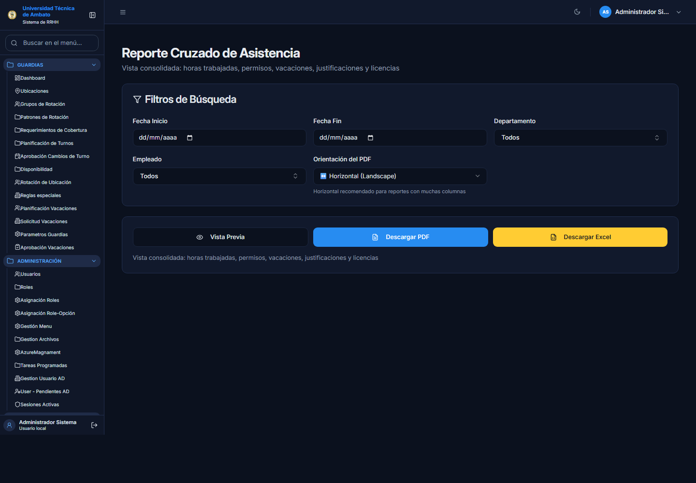

Use este reporte para auditoria, revision de inconsistencias o control operativo.

## 15. Reporte de permisos concedidos

Este reporte muestra permisos concedidos o registrados dentro de un periodo.

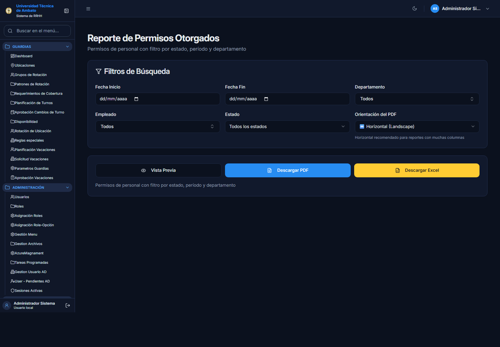

Es util para seguimiento de ausencias, permisos aprobados y control historico.

## Recomendaciones

- Revise sus picadas diariamente.
- Solicite permisos con anticipacion cuando sea posible.
- Adjunte documentos cuando el tipo de permiso lo requiera.
- Use justificaciones solo cuando exista una novedad real de asistencia.
- Revise el estado de sus solicitudes despues de enviarlas.
