# Manual de Usuario: Modulo de Guardias y Turnos Rotativos

## Proposito del manual

Este manual explica, paso a paso, como utilizar el modulo de Guardias y Turnos Rotativos. Esta dirigido a usuarios finales responsables de configurar guardias, revisar turnos, controlar cobertura, aprobar cambios y consultar la operacion diaria.

Las imagenes incluidas corresponden a pantallas reales del sistema y estan ubicadas junto a la explicacion de cada proceso.

Version con imagenes incrustadas directamente en el documento:

`docs/manual-modulo-guardias-turnos-rotativos.html`

## Orden recomendado de uso

Para que el modulo funcione correctamente, se recomienda seguir este orden:

1. Revisar el panel principal.
2. Configurar parametros de guardias.
3. Registrar ubicaciones de servicio.
4. Crear grupos de rotacion.
5. Crear patrones de rotacion.
6. Definir cobertura requerida.
7. Revisar disponibilidad de empleados.
8. Configurar rotacion de ubicaciones.
9. Generar o asignar turnos.
10. Aprobar o rechazar cambios de turno.
11. Registrar reglas especiales.
12. Gestionar vacaciones de guardias.

## 1. Ingreso al sistema

El usuario debe ingresar al sistema desde la pantalla de inicio de sesion. En esta pantalla se colocan las credenciales asignadas por la institucion y luego se presiona **Iniciar Sesion**.

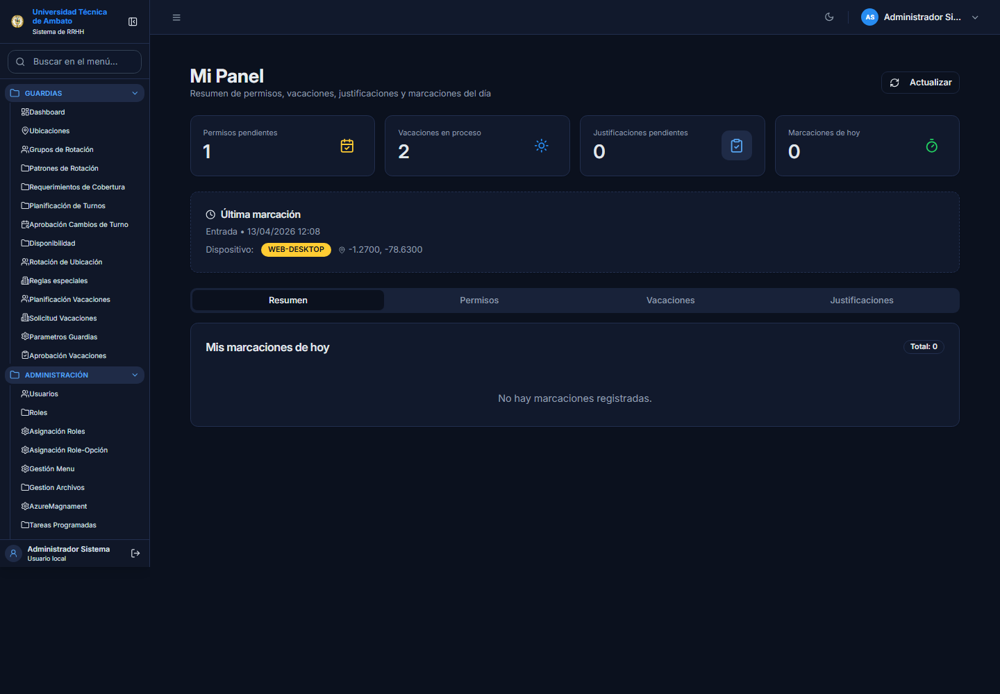

Una vez autenticado, el sistema muestra el menu lateral con las opciones disponibles. El modulo de guardias aparece dentro del grupo **GUARDIAS**.

## 2. Panel de Guardias Rotativos

Pantalla: **Dashboard**

Esta es la pantalla principal del modulo. Permite ver rapidamente la situacion del dia: cuantos turnos existen, si hay puestos sin cobertura, si existen reemplazos pendientes, empleados en permiso o vacaciones y alertas de doble turno.

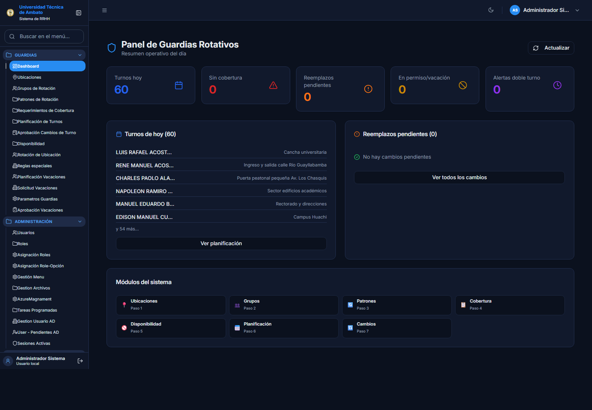

Use esta pantalla para tener una vision general antes de entrar a revisar detalles. Por ejemplo, si el indicador **Sin cobertura** muestra un valor mayor a cero, debe revisar la planificacion o los requisitos de cobertura. Si existen **Reemplazos pendientes**, debe ingresar a la pantalla de cambios de turno.

En la parte inferior se muestran accesos directos al flujo principal del modulo: ubicaciones, grupos, patrones, cobertura, disponibilidad, planificacion y cambios.

## 3. Parametros de Guardias

Pantalla: **Parametros Guardias**

Esta pantalla se utiliza para administrar los valores base que usa el modulo. Estos parametros permiten que las demas pantallas trabajen con listas normalizadas, como tipos de turno, tipos de bloqueo, niveles de grupo y reglas de validacion.

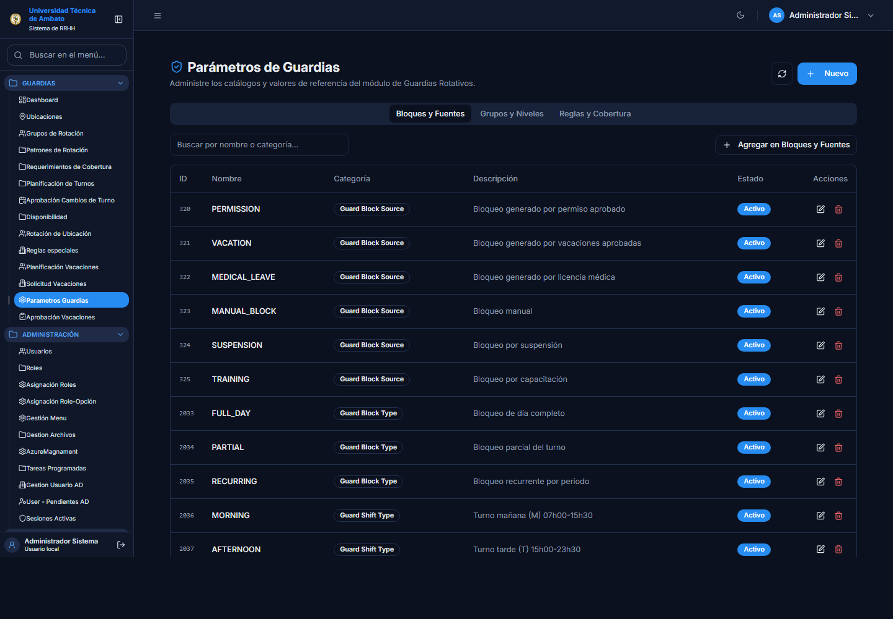

La pantalla esta organizada por pestanas:

- **Bloques y Fuentes**: contiene valores relacionados con permisos, vacaciones, bloqueos manuales, suspensiones, capacitaciones y tipos de turno.
- **Grupos y Niveles**: contiene valores usados para clasificar grupos o subgrupos.
- **Reglas y Cobertura**: contiene valores relacionados con reglas especiales, cobertura y validaciones.

Para crear un parametro, seleccione la pestana correspondiente y presione **Nuevo** o **Agregar en...**. Para modificar un registro existente, use el icono de edicion en la columna **Acciones**. Si un valor ya no debe utilizarse, puede editarlo y marcarlo como inactivo.

### Formulario: Nuevo tipo de referencia

Este formulario se usa para crear un nuevo valor de catalogo. El usuario debe seleccionar la categoria, escribir el nombre del parametro y, si es necesario, agregar una descripcion. El interruptor **Activo** permite definir si el valor estara disponible para usarse inmediatamente.

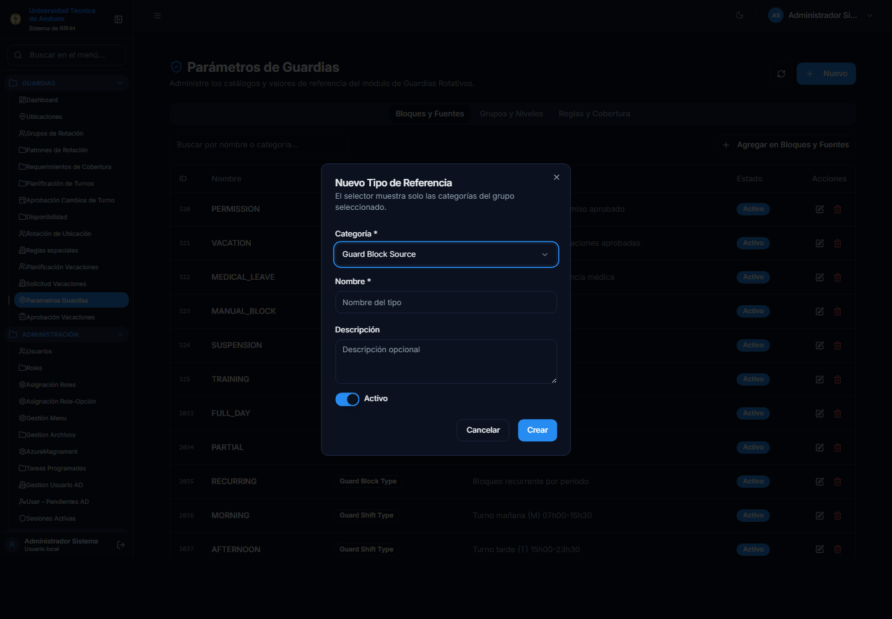

Use este formulario solo cuando el valor que necesita no exista en la lista. Si el valor ya existe, es preferible editarlo en lugar de crear uno duplicado.

## 4. Ubicaciones de Servicio

Pantalla: **Ubicaciones**

En esta pantalla se registran los lugares donde los guardias pueden ser asignados. Una ubicacion puede representar una puerta de ingreso, campus, edificio, dependencia, cancha, sector o punto de control.

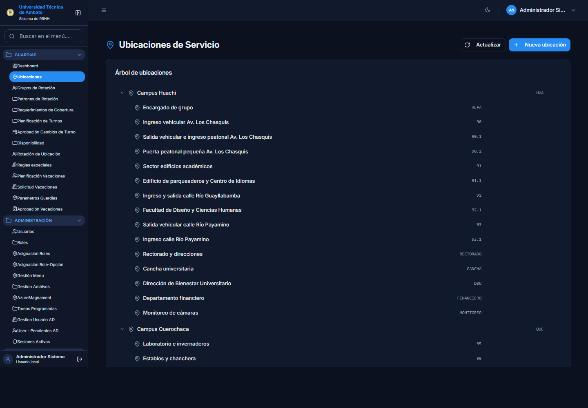

El sistema muestra las ubicaciones en forma de arbol. Esto permite organizar ubicaciones principales y sububicaciones. Por ejemplo, un campus puede contener puertas, edificios o sectores internos.

Cuando cree o edite una ubicacion, revise especialmente estos campos:

- **Requiere cobertura**: indica que esa ubicacion debe ser considerada para control de puestos cubiertos.
- **Asignable a guardias**: permite usar esa ubicacion al planificar turnos.
- **Activo**: indica si la ubicacion sigue disponible.

Una ubicacion que no este marcada como asignable no deberia utilizarse para asignar guardias en la planificacion.

### Formulario: Nueva ubicacion

Este formulario permite registrar un nuevo punto de servicio. El campo principal es **Nombre**; el codigo y la descripcion ayudan a identificar la ubicacion en reportes y consultas.

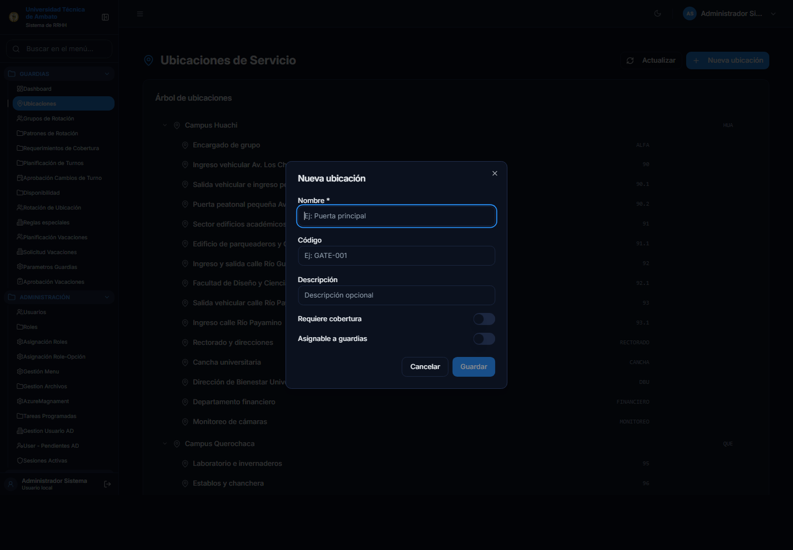

Active **Requiere cobertura** cuando la ubicacion deba ser controlada en los indicadores de cobertura. Active **Asignable a guardias** cuando esa ubicacion pueda recibir turnos en la planificacion.

## 5. Grupos de Rotacion

Pantalla: **Grupos de Rotacion**

Los grupos de rotacion permiten organizar a los guardias en equipos de trabajo. Cada grupo puede tener guardias asignados, subgrupos y un patron de rotacion.

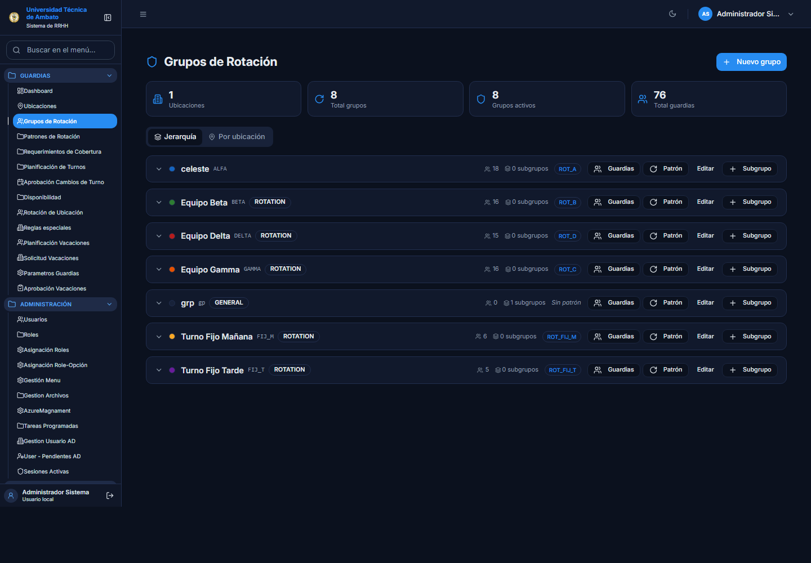

La pantalla tiene dos formas de consulta:

- **Jerarquia**: muestra grupos principales y subgrupos.
- **Por ubicacion**: muestra grupos asociados a ubicaciones.

Desde esta pantalla puede realizar las siguientes acciones:

- Crear un nuevo grupo.
- Crear subgrupos.
- Editar datos del grupo.
- Ver o asignar guardias.
- Asignar un patron de rotacion.

Para que un grupo pueda generar turnos correctamente, debe tener guardias asignados y un patron activo. Si un grupo no tiene patron, el sistema no puede saber que dias trabaja, que dias descansa o que horario corresponde.

### Formulario: Nuevo grupo

Este formulario crea un grupo o subgrupo de rotacion. El usuario debe registrar el nombre, codigo opcional, descripcion, grupo padre si corresponde, nivel y color de identificacion.

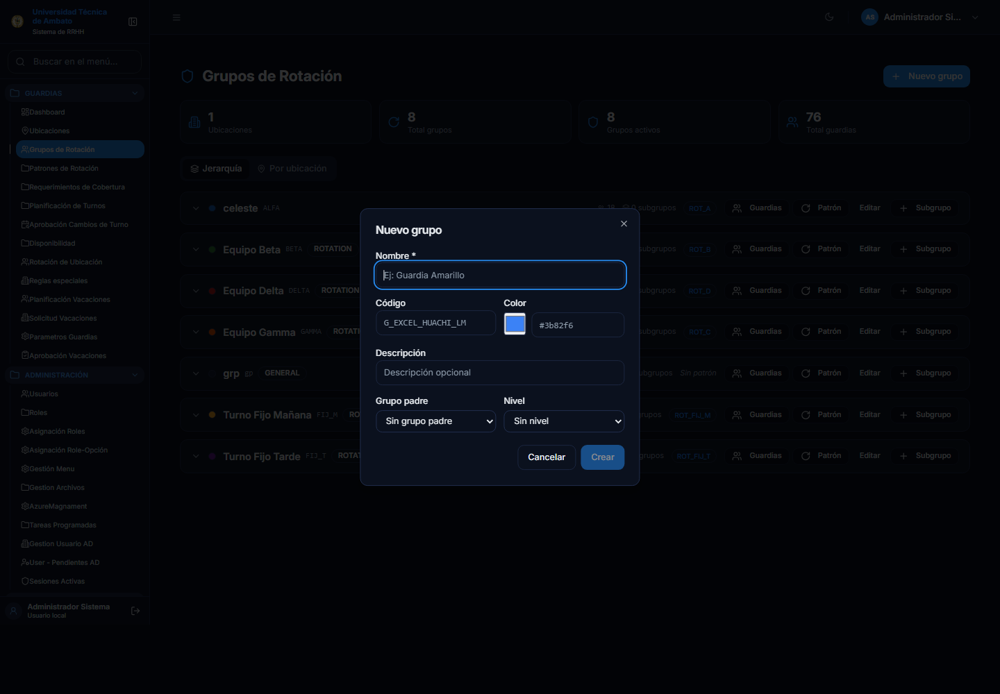

El color ayuda a reconocer visualmente el grupo en la planificacion. Si el grupo pertenece a otro grupo principal, debe seleccionarse como subgrupo para mantener la jerarquia correcta.

### Dialogo: Gestion de guardias del grupo

Desde el boton **Guardias** se abre el dialogo de gestion de integrantes. Aqui se revisan los guardias activos del grupo, se agregan nuevos guardias y se retiran guardias cuando ya no pertenecen al equipo.

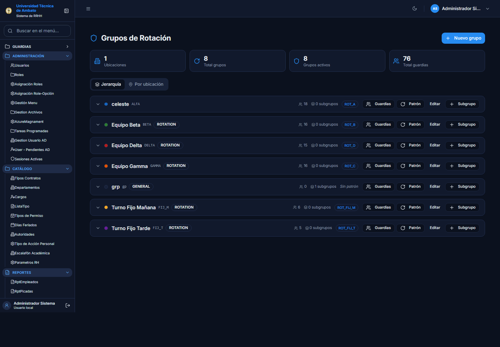

Tambien se puede asignar una ubicacion al guardia dentro del periodo activo. Esto es importante para que el sistema conozca donde trabajara cada persona durante la rotacion.

### Dialogo: Patron del grupo

Desde el boton **Patron** se asigna el patron de rotacion que seguira el grupo. El usuario puede ver el patron activo, quitarlo o asignar uno nuevo.

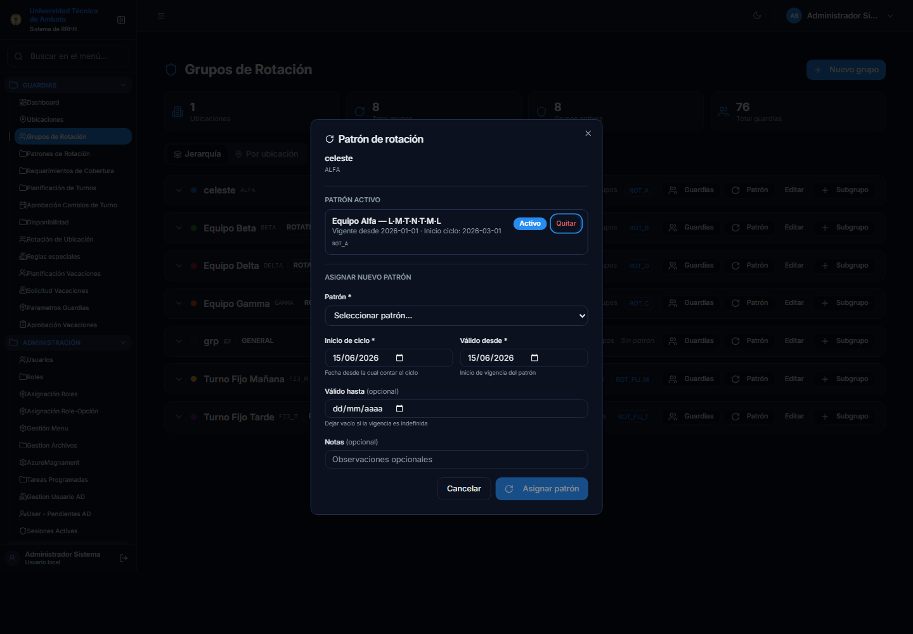

El campo **Inicio de ciclo** indica desde que fecha se cuenta el primer dia del patron. La fecha **Valido desde** define desde cuando aplica el patron para el grupo.

## 6. Patrones de Rotacion

Pantalla: **Patrones de Rotacion**

Los patrones indican la secuencia de trabajo y descanso de los guardias. Por ejemplo, un patron puede definir varios dias de trabajo seguidos, dias libres y turnos de manana, tarde o noche.

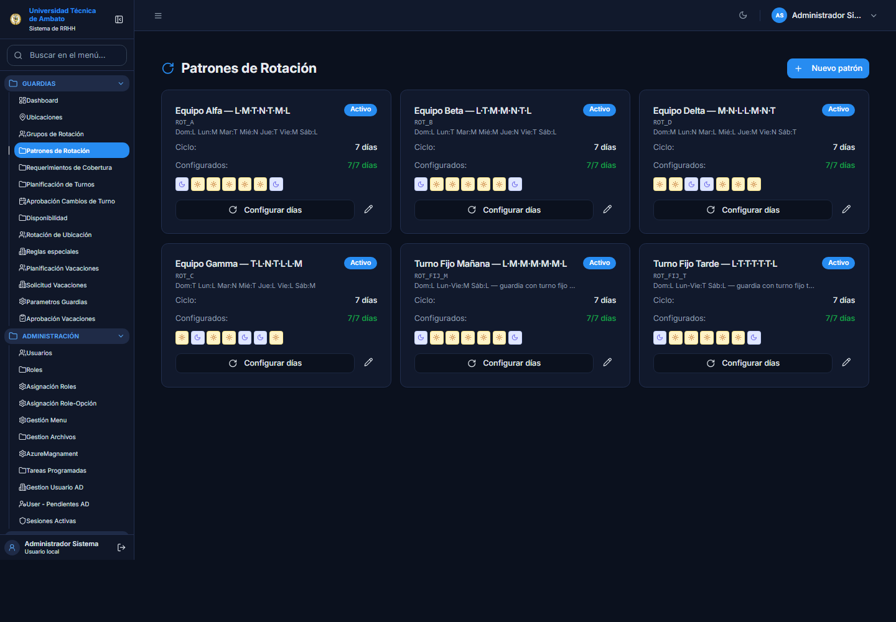

Cada patron tiene un nombre, codigo interno, cantidad de dias del ciclo y detalle por dia. En el detalle se indica si el dia es de descanso o si corresponde a un horario rotativo.

Use esta pantalla cuando necesite:

- Crear un nuevo esquema de rotacion.
- Ajustar los dias de trabajo o descanso.
- Activar o inactivar un patron.
- Ver rapidamente la secuencia del patron.

Despues de crear el patron, debe asignarlo al grupo correspondiente desde la pantalla **Grupos de Rotacion**.

### Formulario: Nuevo patron

Este formulario crea la cabecera del patron. Primero se registra el nombre, codigo, dias del ciclo y descripcion. Luego se completa el detalle de cada dia con horario o descanso.

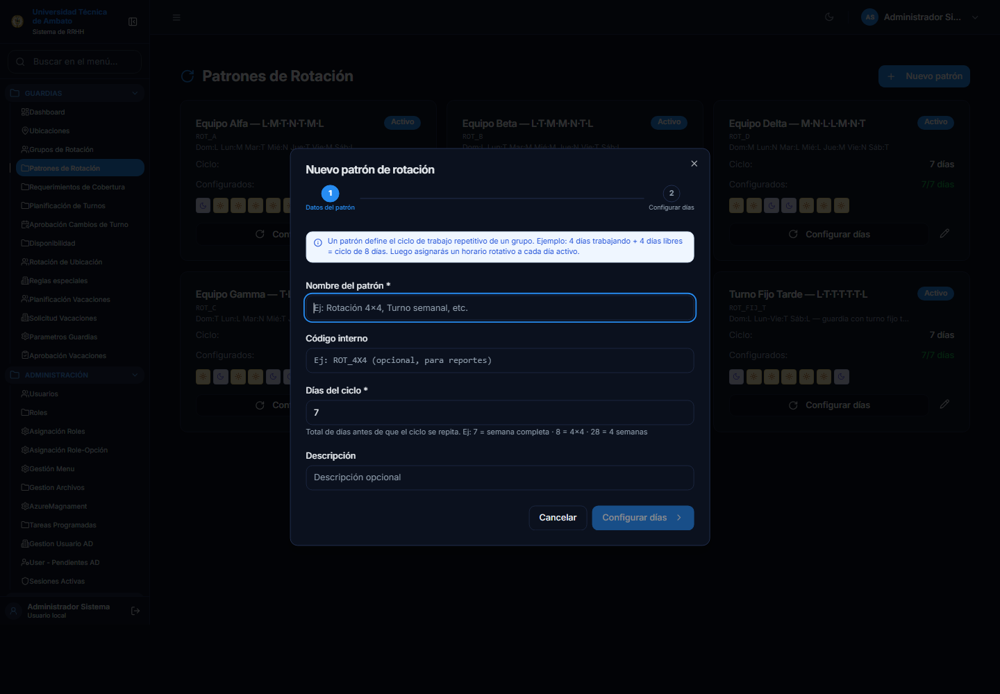

El numero de dias del ciclo es clave. Si se define un ciclo de 8 dias, el sistema repetira esa secuencia cada 8 dias al generar turnos.

## 7. Requisitos de Cobertura

Pantalla: **Requerimientos de Cobertura**

Esta pantalla define cuantos guardias se necesitan por ubicacion, horario y dia de la semana. Sirve para comparar la planificacion real contra la cobertura esperada.

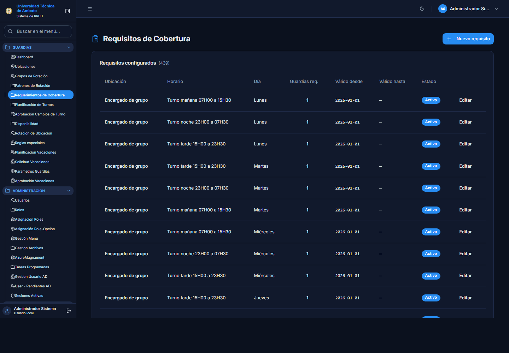

Cada registro de cobertura indica:

- Ubicacion.
- Horario.
- Dia.
- Numero de guardias requeridos.
- Fecha desde la cual aplica.
- Fecha hasta, si tiene fin.
- Estado.

Use esta pantalla antes de generar turnos para asegurar que el sistema conozca cuantas personas deben cubrir cada puesto. Si una ubicacion requiere dos guardias en la noche, por ejemplo, ese valor debe estar registrado aqui.

### Formulario: Nuevo requisito de cobertura

Este formulario define la necesidad minima de guardias. El usuario selecciona ubicacion, horario, dia de la semana y cantidad de guardias requeridos.

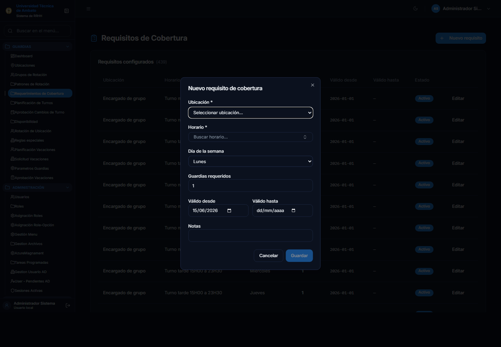

Las fechas de vigencia permiten que una regla aplique solo durante un periodo. Si no existe fecha final, la cobertura se considera vigente hasta que sea modificada o inactivada.

## 8. Disponibilidad de Empleados

Pantalla: **Disponibilidad**

Esta pantalla muestra los periodos en los que un empleado no esta disponible para ser asignado a turnos. La indisponibilidad puede venir de permisos, vacaciones, licencias, suspensiones, capacitaciones o bloqueos manuales.

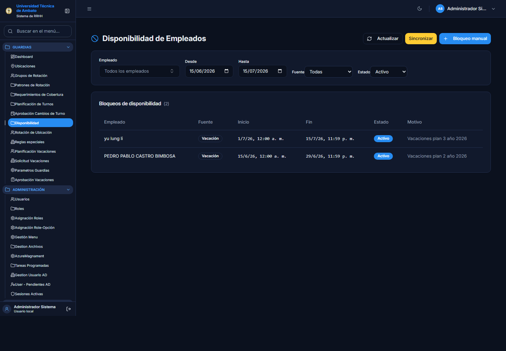

Puede filtrar la informacion por empleado, fecha, fuente y estado. Tambien puede usar las opciones:

- **Sincronizar**: actualiza bloqueos desde permisos o vacaciones.
- **Bloqueo manual**: registra una indisponibilidad directamente desde el modulo.
- **Actualizar**: refresca la informacion mostrada.

Antes de generar turnos, es recomendable revisar esta pantalla para evitar asignar guardias que se encuentren con permiso, vacaciones u otro impedimento.

### Formulario: Crear bloqueo manual

Este formulario se usa cuando se necesita bloquear manualmente la disponibilidad de un empleado. Debe seleccionarse el empleado, el tipo de bloqueo, fecha y hora de inicio, fecha y hora de fin, y un motivo.

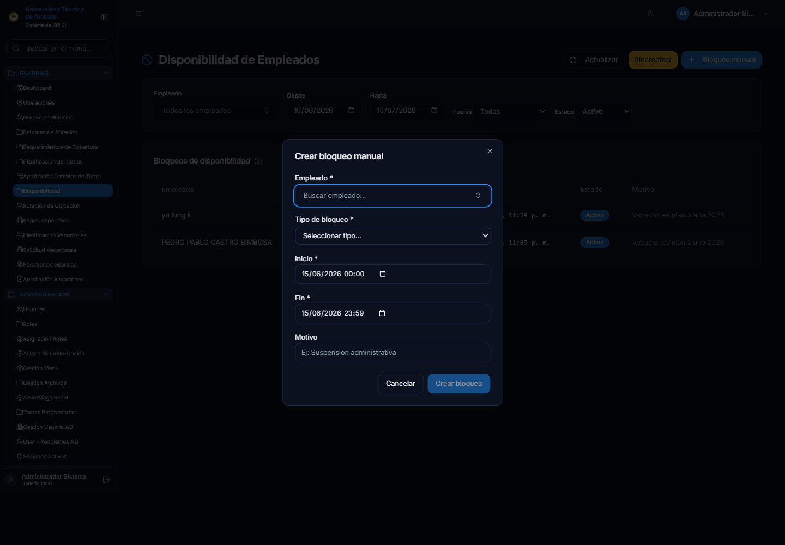

Use este bloqueo cuando la indisponibilidad no provenga automaticamente de permisos o vacaciones, por ejemplo por una suspension administrativa o una capacitacion especial.

### Dialogo: Sincronizar disponibilidad

Este dialogo permite traer al modulo los bloqueos generados por permisos y vacaciones dentro de un rango de fechas.

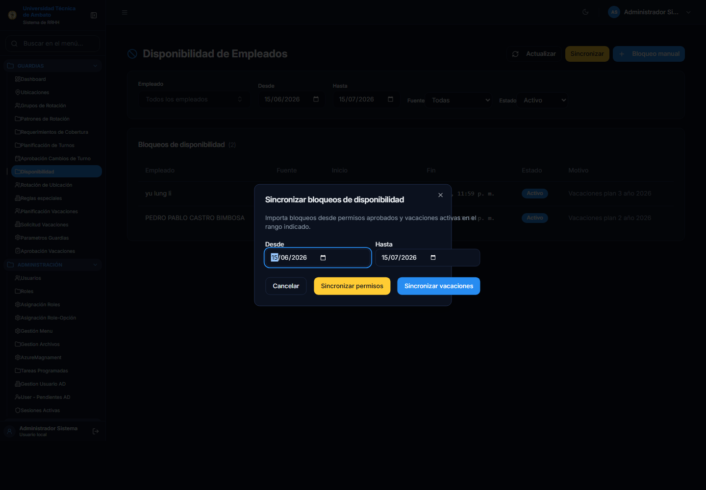

Ejecute esta sincronizacion antes de generar turnos de un nuevo periodo. Asi el sistema podra advertir si un guardia no esta disponible.

## 9. Rotacion de Ubicacion

Pantalla: **Rotacion de Ubicacion**

Esta pantalla permite organizar en que ubicacion trabajara un grupo o guardia durante un periodo determinado. Es util cuando los equipos rotan entre distintos puntos de servicio.

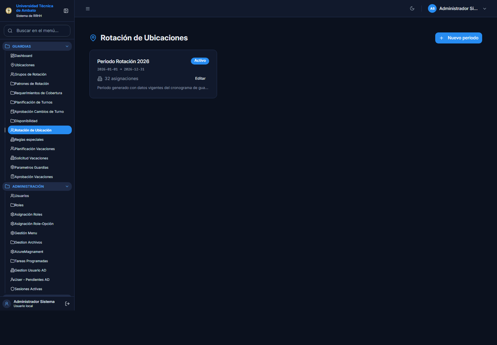

Primero se crea un periodo de rotacion, indicando fecha de inicio y fecha de fin. Luego se agregan las asignaciones de ubicacion para los grupos o guardias.

Use esta pantalla para:

- Crear periodos de rotacion.
- Consultar asignaciones de un periodo.
- Asignar ubicaciones a grupos.
- Marcar si una ubicacion o turno es fijo.
- Eliminar asignaciones que ya no correspondan.

Si la planificacion muestra que faltan ubicaciones asignadas, revise esta pantalla antes de generar nuevamente los turnos.

### Formulario: Nuevo periodo de rotacion

Este formulario crea el periodo en el que se organizaran las asignaciones de ubicacion. Debe registrar nombre, fecha de inicio, fecha de fin y notas opcionales.

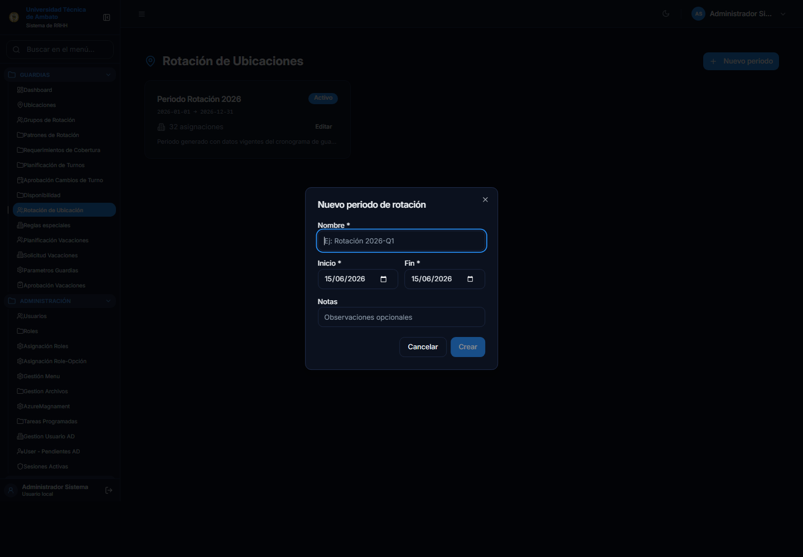

El periodo activo es usado por el sistema para saber que asignaciones de ubicacion deben considerarse en la planificacion.

## 10. Planificacion de Turnos

Pantalla: **Planificacion de Turnos**

Esta es una de las pantallas mas importantes del modulo. Permite revisar el cronograma, generar turnos y asignar guardias manualmente.

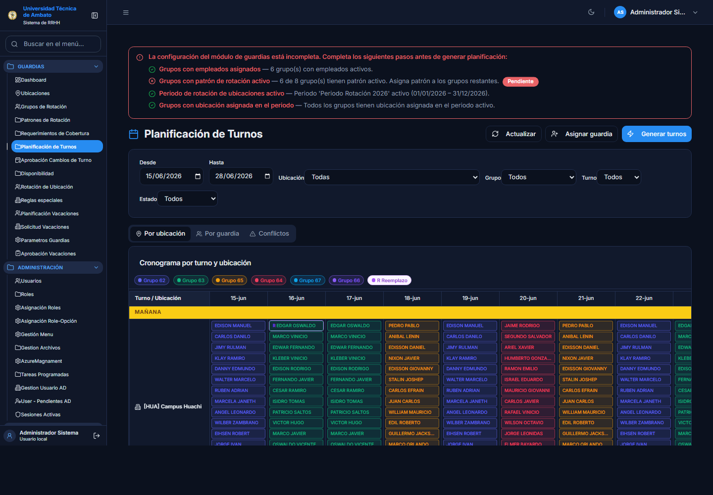

En la parte superior se muestra una alerta de preparacion. Esta alerta indica si el modulo esta listo para generar planificaciones o si falta completar informacion, como grupos sin patron activo o grupos sin ubicacion asignada.

La pantalla permite filtrar por:

- Fecha desde.
- Fecha hasta.
- Ubicacion.
- Grupo.
- Turno.
- Estado.

Tambien cuenta con tres vistas:

- **Por ubicacion**: muestra el cronograma agrupado por turno y ubicacion.
- **Por guardia**: muestra la planificacion por empleado.
- **Conflictos**: muestra registros con advertencias, permisos, vacaciones o cancelaciones.

Acciones principales:

- **Generar turnos**: crea turnos automaticamente segun grupos, patrones, ubicaciones y fechas.
- **Asignar guardia**: permite registrar una asignacion manual.
- **Actualizar**: vuelve a cargar la planificacion.

Antes de confirmar una generacion, revise los mensajes de advertencia. Si el sistema indica que faltan patrones o ubicaciones, debe corregir esos datos antes de generar los turnos definitivos.

### Formulario: Asignar guardia manualmente

Este formulario permite crear un turno individual sin usar la generacion automatica. Se debe seleccionar guardia, fecha, turno rotativo, ubicacion y, opcionalmente, grupo y notas.

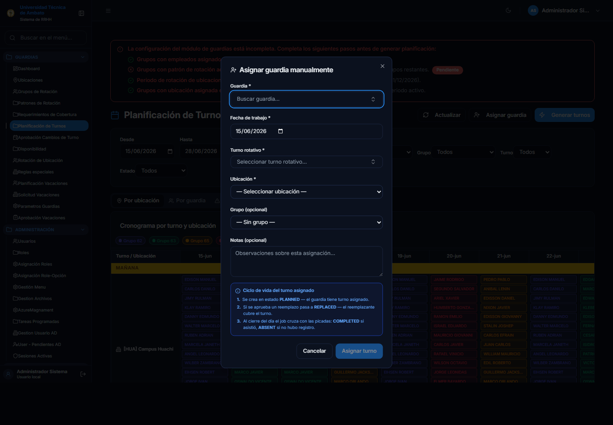

Use esta opcion para ajustes puntuales, reemplazos operativos o turnos que no se generaron automaticamente.

### Dialogo: Generar planificacion automatica

Este dialogo permite crear turnos de forma masiva. El usuario selecciona el modo de generacion, el tratamiento de registros existentes, el rango de fechas y si desea incluir dias libres en la vista previa.

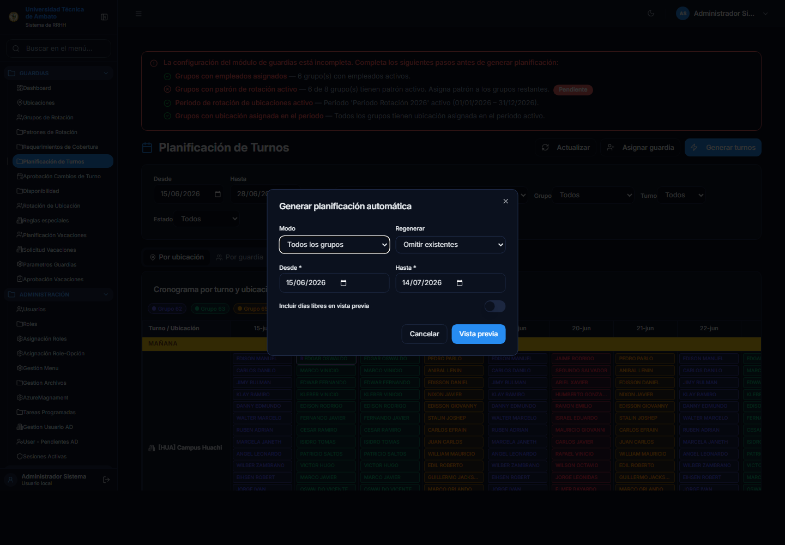

Primero presione **Vista previa** para revisar el resultado. Solo confirme la generacion si no existen errores importantes o si las advertencias ya fueron revisadas.

## 11. Cambios de Turno

Pantalla: **Aprobacion Cambios de Turno**

Esta pantalla permite revisar solicitudes de reemplazo, intercambio o cambio de horario. El usuario responsable puede aprobar o rechazar cada solicitud.

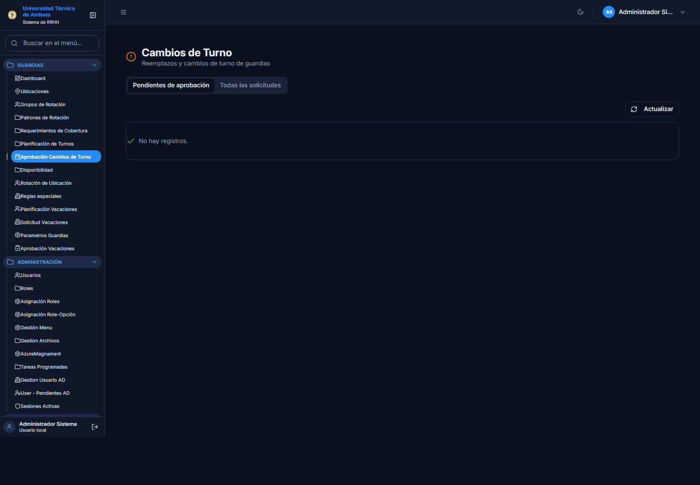

La pantalla tiene dos pestanas:

- **Pendientes de aprobacion**: muestra solicitudes que aun requieren decision.
- **Todas las solicitudes**: permite revisar el historial y filtrar por estado.

Cada solicitud muestra la fecha, guardia original, reemplazante, horario, tipo de cambio, estado y fecha de solicitud.

Para aprobar, use el icono de confirmacion y registre notas si es necesario. Para rechazar, use el icono correspondiente y escriba el motivo del rechazo.

## 12. Reglas Especiales

Pantalla: **Reglas especiales**

Esta pantalla permite registrar condiciones particulares de un guardia. Por ejemplo, que no realice turnos de noche, que trabaje solo dias habiles, que tenga una ubicacion fija o que tenga prioridad para ciertos turnos.

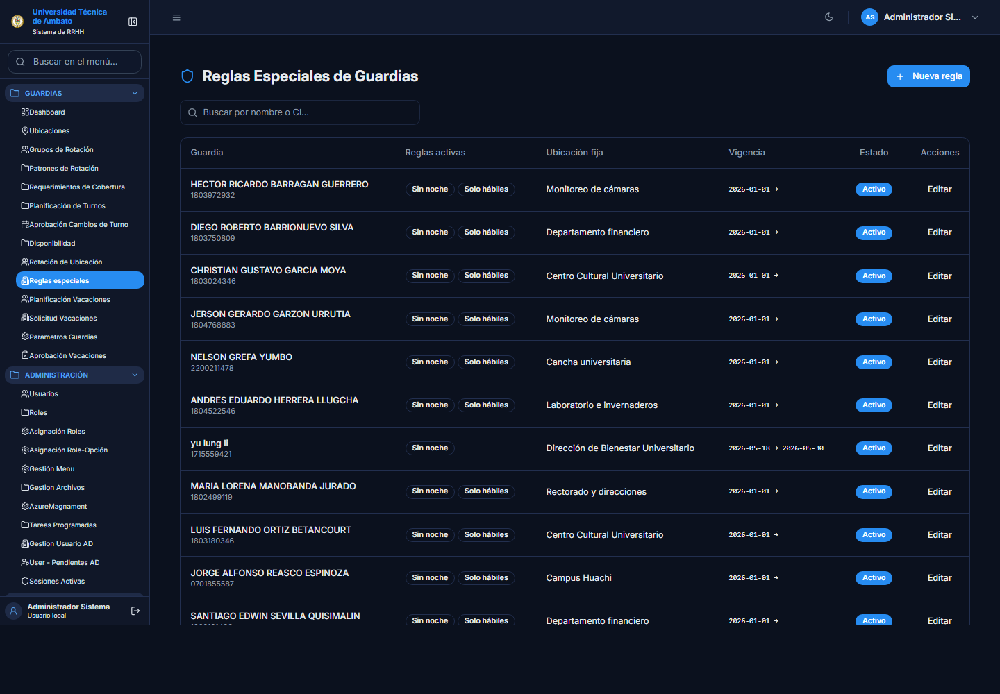

Use esta pantalla cuando un guardia tenga una restriccion o preferencia autorizada. Las reglas ayudan a que la planificacion advierta situaciones que deben revisarse antes de asignar turnos.

Al crear o editar una regla, revise:

- Guardia.
- Ubicacion fija, si aplica.
- Sin noche.
- Solo dias habiles.
- Prioridad fin de semana.
- Prioridad noche.
- Motivo.
- Vigencia.
- Estado.

### Formulario: Nueva regla especial

Este formulario registra una condicion particular para un guardia. El usuario selecciona el guardia, define restricciones o prioridades, escribe el motivo y establece la vigencia.

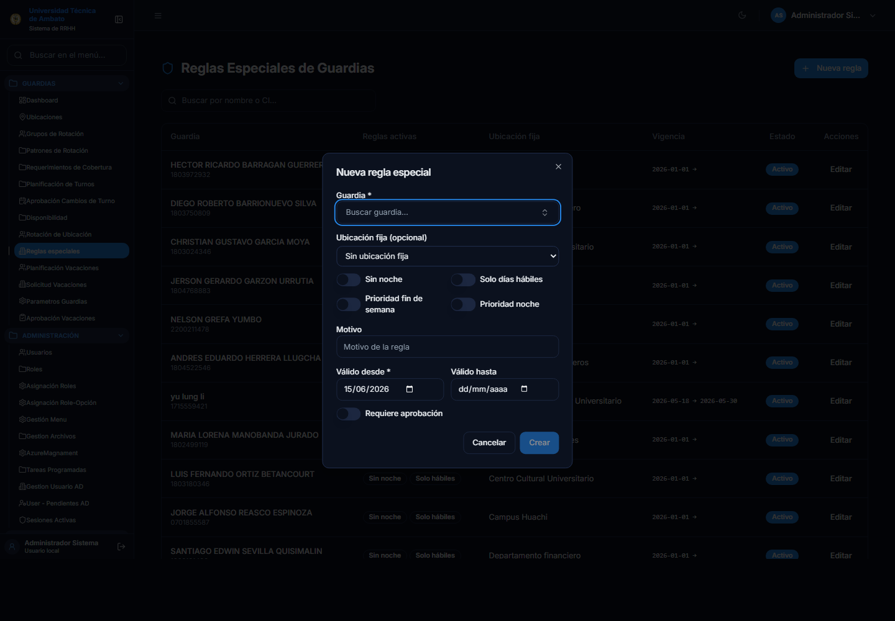

La regla debe tener un motivo claro, especialmente si limita turnos nocturnos, fija una ubicacion o requiere aprobacion.

## 13. Planificacion de Vacaciones

Pantalla: **Planificacion Vacaciones**

Esta pantalla se usa para registrar, revisar y enviar a aprobacion los planes de vacaciones de guardias.

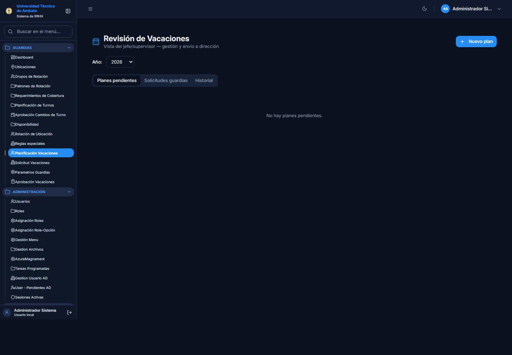

La pantalla muestra planes pendientes, solicitudes de guardias e historial. Desde aqui se puede crear un nuevo plan, enviarlo a direccion o rechazarlo si corresponde.

Al crear un plan de vacaciones se debe indicar:

- Guardia.
- Ano de vacaciones.
- Fecha de inicio planificada.
- Fecha de fin planificada.
- Notas.

Una vez aprobado el plan, debe considerarse en disponibilidad para evitar que el guardia sea asignado durante su periodo de vacaciones.

### Formulario: Nuevo plan de vacaciones

Este formulario permite registrar un plan de vacaciones para un guardia. Se debe seleccionar el guardia, el ano de vacaciones, fecha de inicio, fecha de fin y notas si aplica.

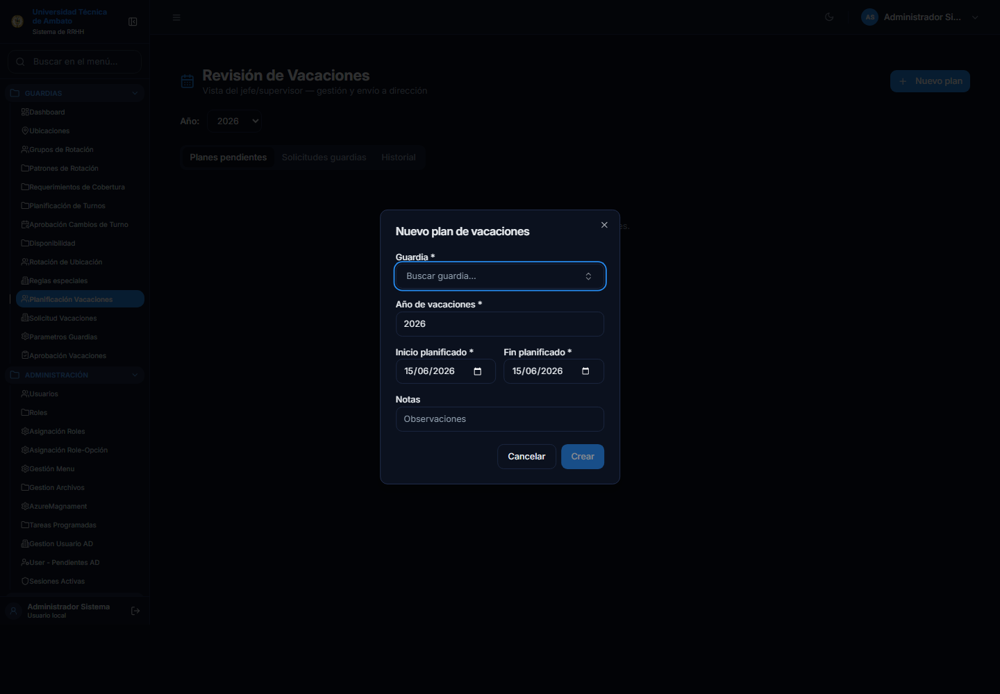

Cuando el plan este completo, puede enviarse a direccion para su revision y aprobacion.

## 14. Solicitud de Vacaciones

Pantalla: **Solicitud Vacaciones**

Esta pantalla corresponde a la vista del guardia para consultar sus vacaciones aprobadas y registrar solicitudes relacionadas con ellas.

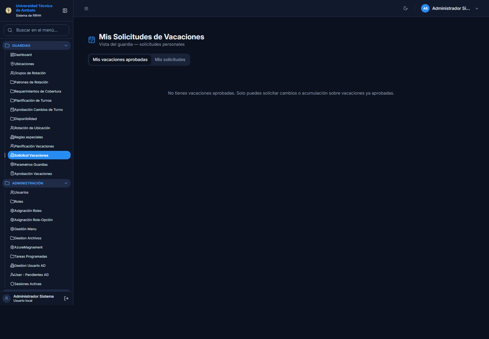

El usuario puede solicitar:

- Cambio de fechas.
- Acumulacion de vacaciones.

Cada solicitud debe incluir el motivo correspondiente. Luego pasa al flujo de revision y aprobacion.

## 15. Aprobacion de Vacaciones

Pantalla: **Aprobacion Vacaciones**

Esta pantalla permite revisar planes y solicitudes de vacaciones enviados para aprobacion. El usuario responsable puede aprobar o rechazar segun corresponda.

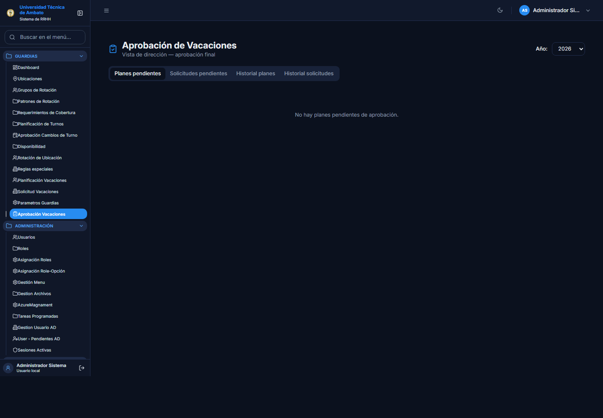

Revise cuidadosamente el periodo solicitado, el guardia y las observaciones antes de aprobar. Si se rechaza una solicitud, se debe registrar un motivo claro.

## 16. Reportes del modulo

Los reportes permiten consultar, imprimir o descargar informacion del modulo. Cada reporte incluye filtros de busqueda y opciones de salida, como vista previa, PDF o Excel.

### Reporte: Planificacion de Turnos de Guardias

Este reporte muestra el detalle de turnos asignados por guardia, grupo y ubicacion dentro de un periodo.

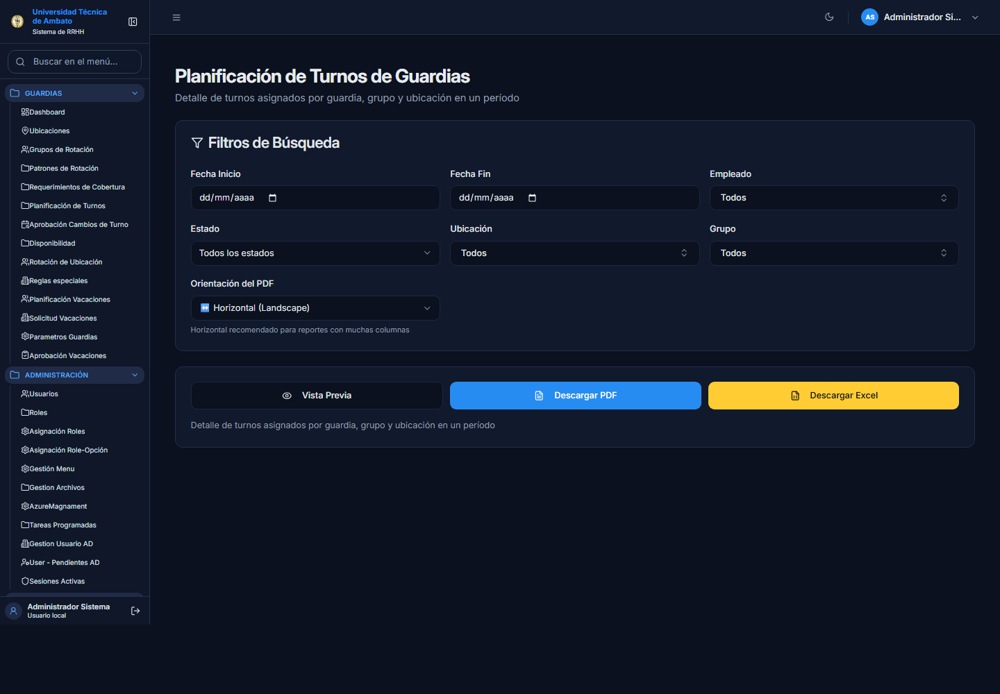

Use los filtros de fecha, empleado, ubicacion, grupo y estado para limitar la consulta. La orientacion del PDF permite ajustar la salida cuando el reporte tiene muchas columnas.

### Reporte: Cobertura de Guardias por Ubicacion

Este reporte permite revisar la cobertura por ubicacion, fecha y turno. Es util para identificar puestos cubiertos y posibles faltantes.

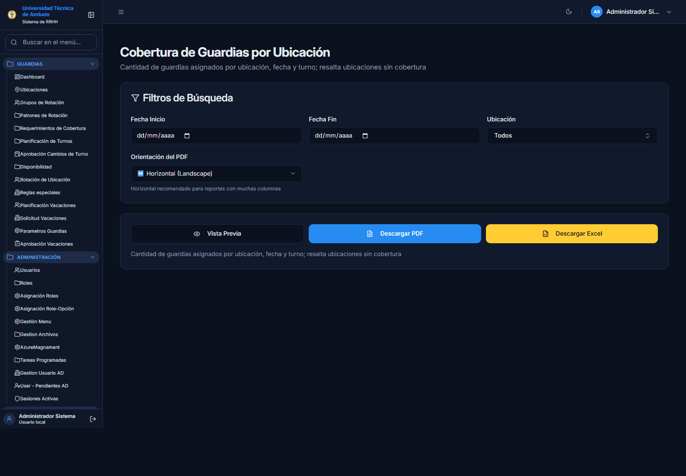

Utilicelo cuando necesite validar que las ubicaciones que requieren cobertura tengan la cantidad correcta de guardias asignados.

### Reporte: Cambios de Turno y Reemplazos

Este reporte lista reemplazos, cambios de turno, solicitudes aprobadas, rechazadas o pendientes.

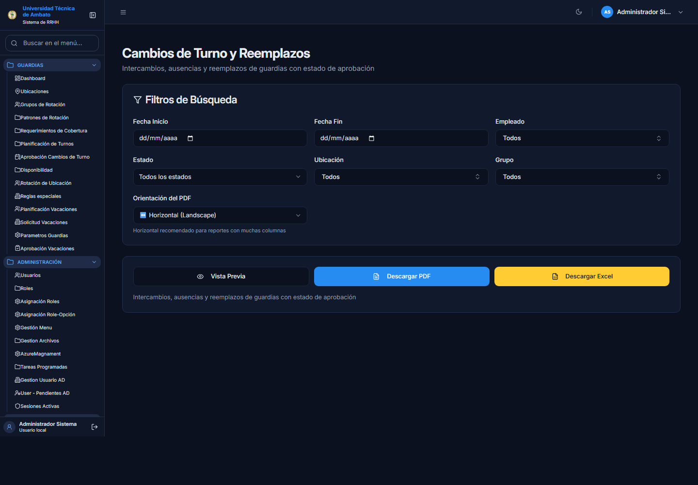

Use este reporte para auditoria o seguimiento de novedades, especialmente cuando se necesite justificar quien cubrio un turno originalmente asignado a otro guardia.

### Reporte: Guardias por Grupo y Ubicacion

Este reporte muestra los guardias activos organizados por grupo y ubicacion.

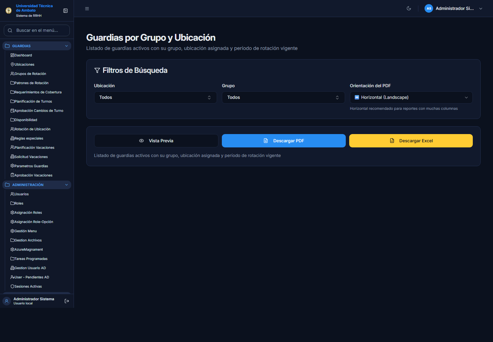

Es util para revisar la composicion de los equipos y confirmar que cada grupo tenga integrantes asignados.

### Reporte: Cronograma Matricial de Guardias

Este reporte presenta el cronograma en formato matricial, donde las filas corresponden a guardias y las columnas a fechas.

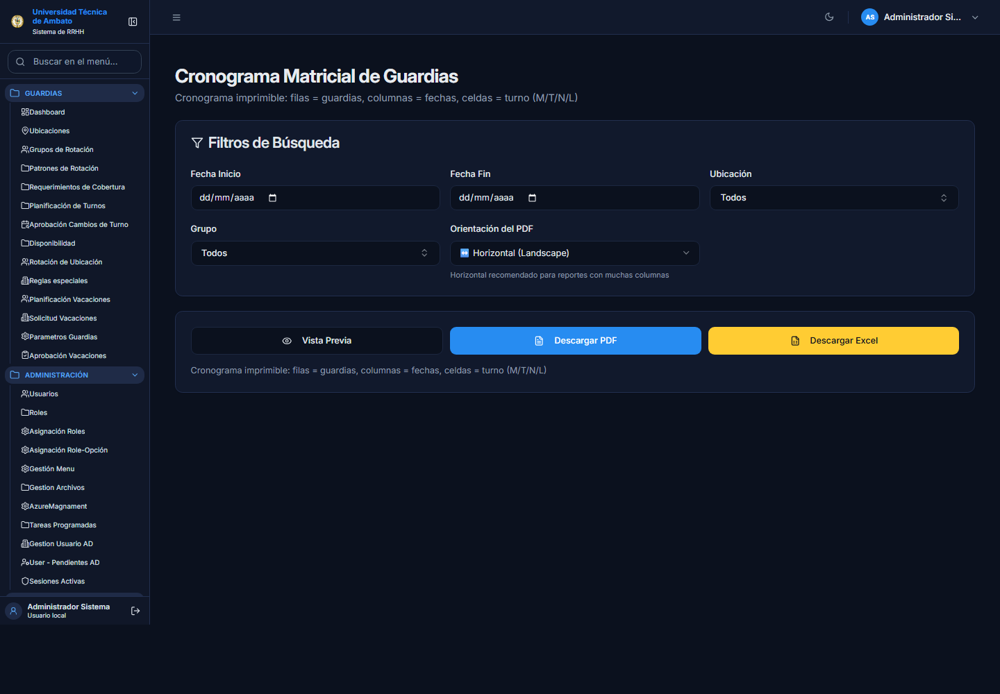

Use este reporte para imprimir o revisar rapidamente la distribucion de turnos en un periodo.

## Recomendaciones para el usuario

- Configure primero parametros, ubicaciones, grupos y patrones.
- Antes de generar turnos, revise que no existan alertas de configuracion.
- Sincronice disponibilidad antes de planificar periodos grandes.
- Revise la vista de conflictos despues de generar turnos.
- Apruebe o rechace cambios de turno oportunamente para mantener actualizado el cronograma.
- Mantenga activas solo las ubicaciones, patrones y reglas que se usan realmente.

## Ubicacion de imagenes

Las imagenes usadas en este manual se encuentran en:

`docs/assets/manual-guardias/`

Si se actualiza el diseno del sistema, se recomienda volver a capturar las pantallas y reemplazar los archivos PNG conservando los mismos nombres.
